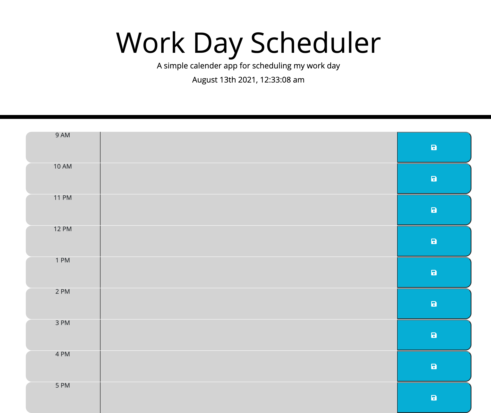

# Work-Day-Scheduler-Project

This work day scheduler is create as a simple calendar application that allows a user to save events for each hour of the day. Each hour of the day is color coded. Grey signifies the past, red signifies the current hour and green signifies the future.
This app will run in the browser and feature dynamically updated HTML and CSS powered by jQuery.

GitHub repo URL: https://github.com/tpham912/Work-Day-Scheduler-Project

Deployed URL: https://tpham912.github.io/Work-Day-Scheduler-Project/

